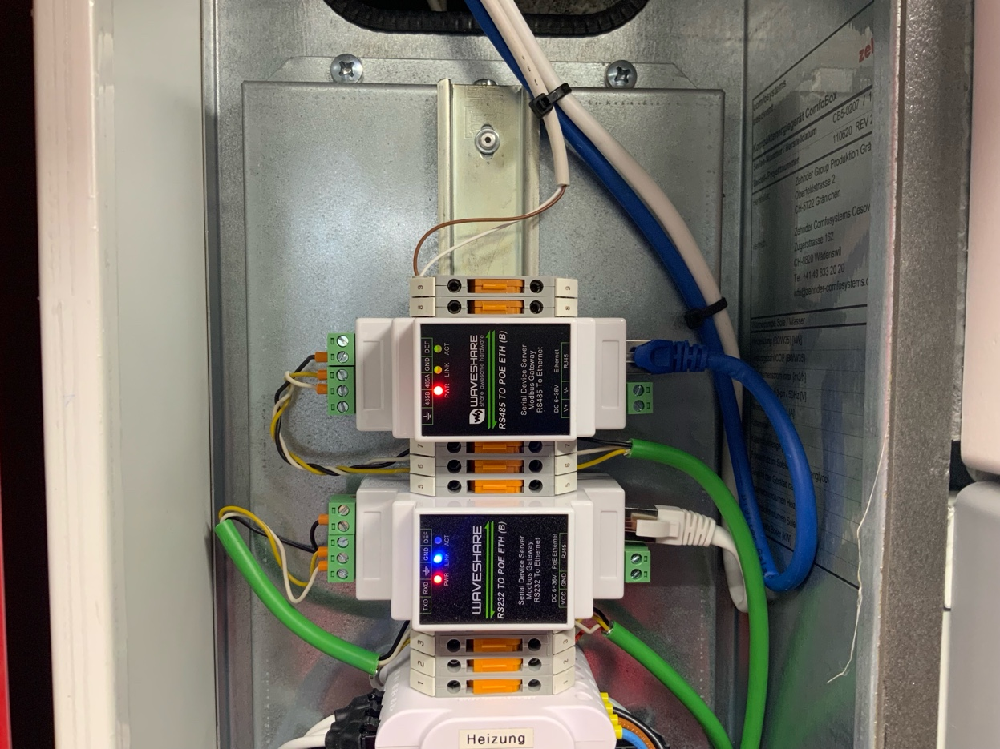
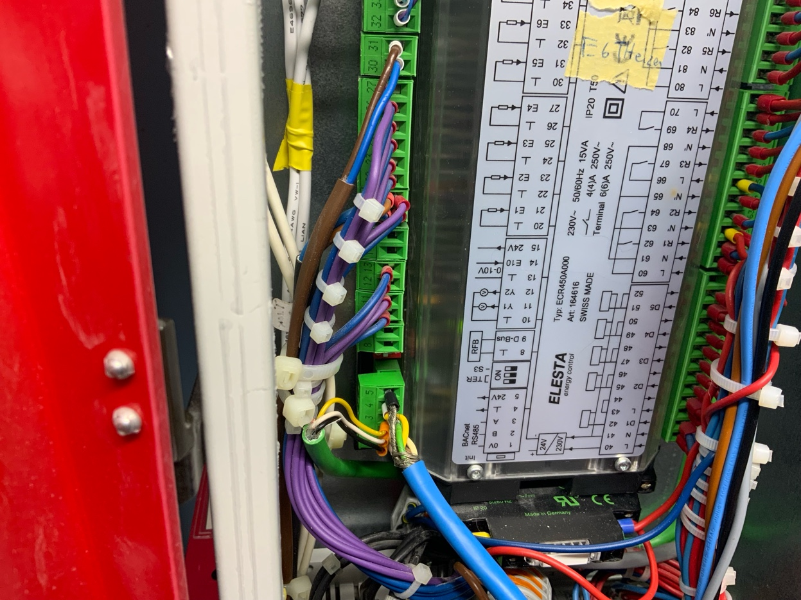

# ComfoBox MQTT Bridge — Home Assistant Add-on

Connects a **Zehnder ComfoBox Series 5 (ELESTA)** to Home Assistant via MQTT, using a Waveshare RS485/Ethernet adapter. Based on the [RF77 ComfoBox2Mqtt](https://github.com/RF77/comfobox-mqtt) project (v0.4.0).

---

## Architecture

```
ComfoBox Series 5
  │ RS485 / BACnet MSTP
  ▼
Waveshare RS485-to-ETH (TCP Server, Port 8899)
  │ TCP
  ▼
socat PTY Bridge (inside add-on container)
  │ virtual serial port (/dev/pts/X)
  ▼
Mono — RF77 ComfoBoxMqttConsole.exe
  │ MQTT
  ▼
Mosquitto Broker (core-mosquitto)
  │
  ▼
Home Assistant
```

---

## Requirements

### Hardware

* Zehnder ComfoBox Series 5 (ELESTA controller, type ECR450A000)
* Waveshare RS485-to-POE-ETH (B) adapter
* RS485 cable: ComfoBox RS485 port → Waveshare A/B terminals

### Waveshare Configuration



Open `http://<waveshare-ip>` in your browser (no password):

* **Work Mode:** TCP Server
* **Local Port:** 8899
* **Baud Rate:** 38400 (must match the ComfoBox OEM setting)
* **Data Bits:** 8, **Parity:** None, **Stop Bits:** 1

### ComfoBox OEM Menu

The ComfoBox must be configured to **38400 baud** (factory default is 76800). This is done via the OEM menu on the ComfoBox control unit.

> **Note:** Without this change, the ComfoBox sends RS485 data but no valid BACnet MS/TP — the add-on will not receive an IAm and will not start.

### RS485 Wiring



ComfoBox ELESTA ECR450A000 BACnet RS485 terminals:
* Terminal 0 = 0V (shield/GND)
* Terminal 1 = B (negative)
* Terminal 2 = A (positive)

Connect to Waveshare accordingly: A→A, B→B, GND→0V

### MQTT Broker

The add-on requires **anonymous MQTT access** — RF77's ComfoBoxMqttConsole does not support MQTT authentication.

Mosquitto configuration (`/share/mosquitto/mosquitto.conf`):

```
listener 1883
allow_anonymous true
```

---

## Installation

1. **Add repository** in HA under Settings → Apps → Repositories:

   ```
   https://github.com/ptpat/ha-comfobox-mqtt-addon
   ```
2. **Install the app:** ComfoBox MQTT Bridge
3. **Adjust configuration** (see below)
4. **Start the app**

---

## Configuration

| Option | Type | Default | Description |
| --- | --- | --- | --- |
| `waveshare_host` | string | — | IP address of the Waveshare adapter |
| `waveshare_port` | int | 8899 | TCP port of the Waveshare adapter |
| `baudrate` | int | 38400 | Baud rate (must match ComfoBox OEM setting) |
| `mqtt_host` | string | core-mosquitto | MQTT broker hostname |
| `mqtt_port` | int | 1883 | MQTT broker port |
| `mqtt_base_topic` | string | ComfoBox | MQTT base topic |
| `bacnet_master_id` | int | 1 | BACnet address of the ComfoBox |
| `bacnet_client_id` | int | 3 | BACnet address of this client (must differ from master_id) |

Example:

```yaml
waveshare_host: "192.168.0.24"
waveshare_port: 8899
baudrate: 38400
mqtt_host: core-mosquitto
mqtt_port: 1883
mqtt_base_topic: ComfoBox
bacnet_master_id: 1
bacnet_client_id: 3
```

---

## MQTT Topics

All topics start with the configured `mqtt_base_topic` (default: `ComfoBox`).

Read: `ComfoBox/<category>/<n>`
Write: `ComfoBox/<category>/<n>/Set`

Examples:

* `ComfoBox/Climate/OutdoorTemperature` — outdoor temperature
* `ComfoBox/Ventilation/VentilationMode` — ventilation level
* `ComfoBox/Ventilation/VentilationMode/Set` — set ventilation level
* `ComfoBox/Special/NumberOfWritesPer24h` — number of write operations today

A full topic list is available in the [RF77 documentation](https://github.com/RF77/comfobox-mqtt).

> **Warning:** The ComfoBox stores write values in EEPROM (~1,000,000 write cycles). Use write operations sparingly.

---

## Technical Notes / Known Issues

### aarch64 (HA Green) — tcsetattr ENOTTY

Mono's `SerialPort` calls `tcsetattr()` on the virtual serial port. On ARM/aarch64, the Linux kernel returns `ENOTTY` when the port is a PTY slave. The add-on works around this with an `LD_PRELOAD` shim (`tcsetattr_fix.so`) that intercepts `ENOTTY` and returns success.

### Baud Rate

RF77 reports that on his Raspberry Pi only **38400 baud** worked — the ComfoBox must be reconfigured in the OEM menu (factory default is 76800).

### RS485 Polarity

If no BACnet communication is established, try swapping the A/B wires at the Waveshare adapter.

---

## Current Debugging Status (Hardware: ComfoBox 8 / ELESTA ECR450A000)

> This section documents the current commissioning status.

### Hardware Setup
* **ComfoBox:** Zehnder ComfoBox 8 (8 kW), ELESTA controller type ECR450A000
* **Waveshare:** RS485-TO-POE-ETH (B), IP 192.168.0.24, port 8899, TCP Server mode
* **HA:** Home Assistant Green (aarch64), HA OS 17.1, Core 2026.3.0
* **Wiring:** ComfoBox Terminal 1(B) → Waveshare B, Terminal 2(A) → Waveshare A, Terminal 0(0V) → GND

### What Works
* TCP connection Waveshare ↔ socat: **OK** (Waveshare LINK LED lights blue)
* RS485 data from ComfoBox: **OK** (Waveshare ACT LED flickers with correct A/B polarity)
* LD_PRELOAD tcsetattr_fix.so: **OK** (no more ENOTTY)
* Mono starts and sends WhoIs: **OK**

### What Does Not Work
* BACnet IAm is not received → `Didn't get any messages from the Bacnet Master device`
* No BACnet MS/TP preamble `55 FF` found in raw RS485 dump (via `nc 192.168.0.24 8899 | xxd`)
* Tested baud rates: 38400 (data present), 76800 (only zeros)

### RS485 Raw Dump (38400 baud, 15 seconds)
Repetitive pattern — no `55 FF` BACnet preamble found:
```
00000000: 1886 1838 0cd8 1986 db0c 1a18 9a96 071f
00000010: e767 e3ee f347 5dce 191e ef47 1d1f 19cb
00000020: 4759 dfdf 1819 1838 0cd8 1986 ef0c ...
...
000001c0: d818 8618 380c d818 8618 380c d818 8618
000001d0: 380c d818 8618 380c d818 8618 380c d818
000001e0: 8618 380c d818 8618 380c d818 8618 380c
```

---

## Development History — What Did Not Work

For anyone debugging the same problem, here are the dead ends encountered:

### Alpine Linux (ghcr.io/hassio-addons/base)

The standard HA add-on base uses Alpine with **musl libc**. Mono's `SerialPort.isatty()` returns `false` on musl for PTY slaves → `Not a tty` error. Solution: switch to **Debian bookworm-slim** (glibc).

### /dev/ttyS0 via devices:

`/dev/ttyS0` on HA Green is a dummy UART with no real hardware. `socat` cannot write to it → `I/O error`. No usable serial port this way.

### socat with ispeed/ospeed

`socat PTY,ispeed=76800` — socat does not know 76800 as a standard baud rate → `cfsetispeed: Invalid argument`. Non-standard baud rates are not supported by socat.

### socat rawer instead of raw

`rawer` sets baud rate options internally on the PTY → `cfsetispeed: Invalid argument`. Solution: use `raw`.

### stty before Mono starts

`stty -F /dev/pts/1 38400` on a PTY slave fails silently (`|| true`). Mono still calls `tcsetattr()` → `ENOTTY`. stty does not help.

### socat PTY↔PTY topology

Two socat processes: PTY-A↔PTY-B and PTY-B↔TCP. Mono gets PTY-A. Still `ENOTTY` — PTY slaves on ARM/aarch64 Linux do not fully support `tcsetattr()` regardless of topology.

### Baud rate 76800

RF77 README: *"On my Raspberry only a baudrate of 38400 was working."* The ComfoBox must be reconfigured in the OEM menu.

### Mono from external repository (mono-project.com)

Inside the HA build container there is no internet access for `gpg keyserver` or `curl` to external repos → build fails with exit code 100. Solution: install `mono-complete` directly from the Debian Bookworm standard repository.

---

## License

This add-on is based on [RF77/comfobox-mqtt](https://github.com/RF77/comfobox-mqtt) — see `License rf77` for the original license.
